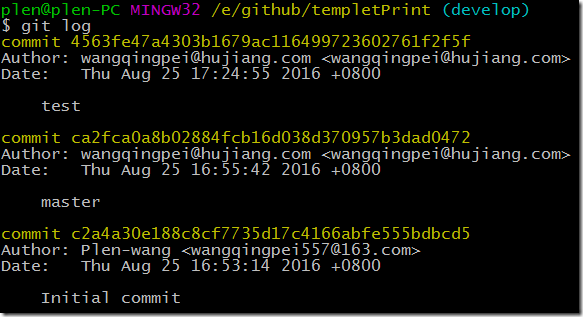
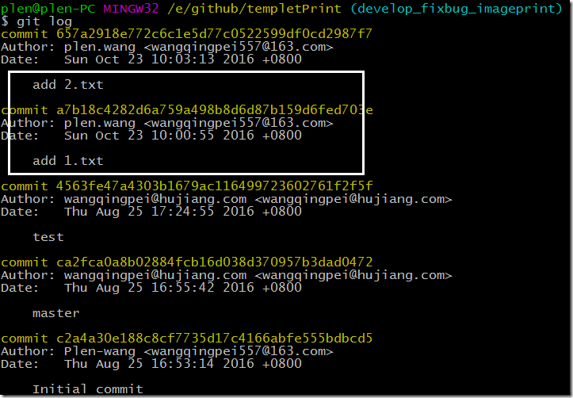
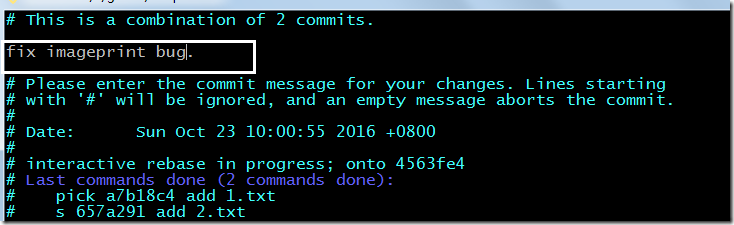

## rebase 的使用【“重新设置基线”】

### 一、git log 【develop】 看下develop分支的信息

### 二、git log 【current-branch】 看下当前从develop切出来的分支

### 三、git reabse –i develop 【这里的”-i“是指交互模式。就是说你可以干预rebase这个事务的过程，包括设置commit message，暂停commit等等。】

### 四、我们设置第二个”pick 657a291 add 2.txt” 为” s 657a291 add 2.txt”这里的s就是squash命令的简写。

### 五、退出保存【wq】的时候跳出一个临时文件，删除之前的两条message(ESC dd)，设置一总的message 然后保存退出。(ESC wq)

### 六、我们查看下log。git log

