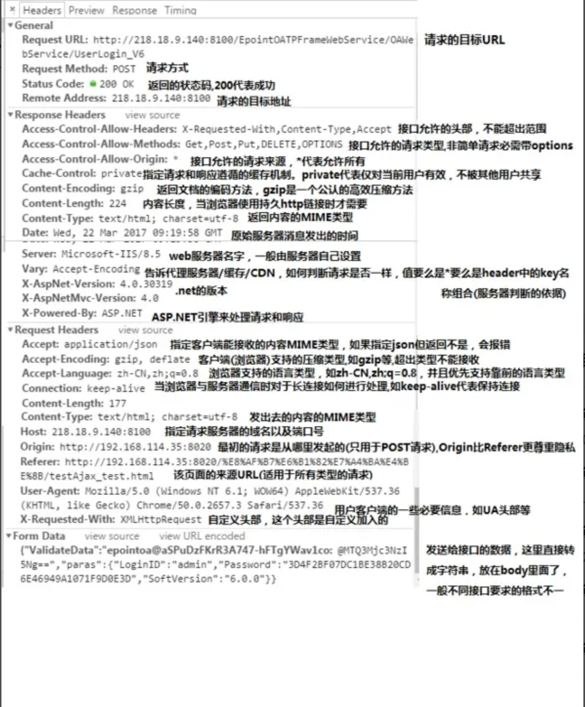

# 常见的HTTP请求头和响应头
## 通用头部
* Request Url: 请求的web服务器地址
* Request Method: 请求方式（Get、POST、OPTIONS、PUT、HEAD、DELETE、CONNECT、TRACE）
* Status Code: 请求的返回状态码，如200代表成功
* Remote Address: 请求的远程服务器地址（会转为IP）
* Referrer Policy: (引用策略)用来监管哪些访问来源信息 (IE暂不支持)


## HTTP Request Header 常见的请求头：
* Accept:浏览器能够处理的内容类型（对标服务端返回的Content-Type）
* Accept-Charset:浏览器能够显示的字符集
* Accept-Encoding：浏览器能够处理的压缩编码。例如 `gzip, deflate`等，超出类型不能接收。
* Accept-Language：浏览器当前设置的语言
* Connection：浏览器与服务器之间连接的类型，例如 `keep-alive`（保持连接）或 `close`（关闭连接）。
* Cookie：当前页面设置的任何Cookie（有cookie并且同域访问时会自动带上）
* Host：发出请求的页面所在的域。例如 `www.example.com:80`
* Referer：发出请求的页面的URL（该页面的来源URL(适用于所有类型的请求，会精确到详细页面地址，csrf拦截常用到这个字段)）
* User-Agent：浏览器的用户代理字符串。例如 `Mozilla/5.0 (Windows NT 10.0; Win64; x64)`。
* If-Modified-Since：对应服务端的Last-Modified，用来匹配看文件是否变动，只能精确到1s之内，http1.0中。
* Expires：缓存控制，在这个时间内不会请求，直接使用缓存，http1.0，而且是服务端时间。
* Max-age：代表资源在本地缓存多少秒，有效时间内不会请求，而是使用缓存，http1.1中。
* If-None-Match：对应服务端的ETag，用来匹配文件内容是否改变（非常精确），http1.1中。
* Origin：最初的请求是从哪里发起的（只会精确到端口）,Origin比Referer更尊重隐私


## HTTP Responses Header 常见的响应头：
* Access-Control-Allow-Headers: 服务器端允许的请求Headers
* Access-Control-Allow-Methods: 服务器端允许的请求方法
* Date：表示消息发送的时间，时间的描述格式由rfc822定义
* server:服务器名称
* Connection：浏览器与服务器之间连接的类型。例如 `keep-alive`（保持连接）或 `close`（关闭连接）。
* Cache-Control：控制HTTP缓存。例如 `no-cache`（不使用缓存）或 `max-age=3600`（缓存有效期）。
* Last-Modified：请求资源的最后修改时间。
* Expires：应该在什么时候认为文档已经过期,从而不再缓存它。
* Max-age：客户端的本地资源应该缓存多少秒，开启了Cache-Control后有效。
* ETag：请求变量的实体标签的当前值。
* Set-Cookie：设置和页面关联的cookie，服务器通过这个头部把cookie传给客户端。
* Keep-Alive：如果客户端有keep-alive，服务端也会有响应（如timeout=38）。
* content-type:表示后面的文档属于什么MIME类型
    * 常见的 Content-Type 属性值有以下四种:
        1. application/x-www-form-urlencoded：浏览器的原生 form 表单，如果不设置 enctype 属性，那么最终就会以 application/x-www-form-urlencoded 方式提交数据。该种方式提交的数据放在 body 里面，数据按照 key1=val1&key2=val2 的方式进行编码，key 和 val 都进行了 URL转码。
        2. multipart/form-data：该种方式也是一个常见的 POST 提交方式，通常表单上传文件时使用该种方式。
        3. application/json：服务器消息主体是序列化后的 JSON 字符串。
        4. text/xml：该种方式主要用来提交 XML 格式的数据。


HTTP 请求报文由**请求行**、**请求头**和**请求体**（可选）组成。其中，**请求头**包含了客户端向服务器发送的附加信息，用于描述请求的上下文、客户端的能力或偏好等。以下是一些常见的请求头字段及其作用：

---

### **示例：一个完整的 HTTP 请求报文**
```http
GET /index.html HTTP/1.1
Host: www.example.com
User-Agent: Mozilla/5.0 (Windows NT 10.0; Win64; x64)
Accept: text/html,application/xhtml+xml,application/xml;q=0.9,image/webp,*/*;q=0.8
Accept-Language: en-US,en;q=0.5
Accept-Encoding: gzip, deflate
Connection: keep-alive
Cookie: sessionId=abc123
```

---

### **总结**
HTTP 请求头提供了客户端和服务器之间通信的关键信息，帮助服务器理解请求的上下文并作出适当的响应。根据具体的应用场景，请求头的内容和数量会有所不同。
一般来说，请求头部和响应头部是匹配分析的。  
譬如，请求头部的Accept要和响应头部的Content-Type匹配，否则会报错  
譬如，跨域请求时，请求头部的Origin要匹配响应头部的Access-Control-Allow-Origin，否则会报跨域错误  
譬如，在使用缓存时，请求头部的If-Modified-Since、If-None-Match分别和响应头部的Last-Modified、ETag对应   
 
